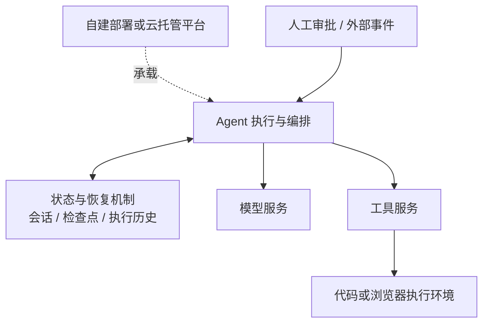

# Agent Runtime 实现方案：开源框架与云托管平台

一个 Agent 已经能够调用模型和工具，接下来如何让它持续运行、保存进度，并在中断后继续完成任务？本文比较开源框架、持久执行系统与云托管平台，梳理阿里云、火山引擎、AWS、Google Cloud、Microsoft、腾讯云及 Cloudflare 的不同实现路线，重点解释各层承担的职责、恢复边界和组合方式。

本文属于 [运行时与编排](../resources/runtime-and-orchestration.md) 主题。部署平台的资源条目在 [部署与调度](../resources/deployment-and-scheduling.md) 维护；检查点、重放和外部副作用的机制分析见 [任务失败后如何恢复](task-recovery-and-side-effects.md)。

## Runtime 在管理什么

Runtime 经常同时出现在框架、工作流引擎和云服务的名称中。阅读一个方案时，可以先确定它主要管理的对象，再讨论与其他方案的关系。

| 主要职责 | 管理对象与典型机制 | 需要回答的问题 |
| --- | --- | --- |
| 执行与编排 | Agent 循环、图节点、工具调用、多 Agent 消息 | 下一步做什么，何时结束或等待外部输入？ |
| 状态与持久执行 | 会话、检查点、事件历史、重试和恢复入口 | 哪些进度能保留，中断后从哪里继续？ |
| 运行托管 | 进程、容器、会话实例、身份、网络和伸缩 | 代码在哪里运行，由谁维护运行环境？ |
| 工具执行环境 | 工作目录、代码进程、浏览器和隔离边界 | Agent 的操作在哪里发生，环境如何保存和释放？ |

这些职责可以由同一产品覆盖，也可以分别实现。例如，框架负责安排工具调用，数据库保存检查点，托管平台运行服务，沙箱执行工具代码。比较时应分别记录 **开放程度** 与 **交付方式**：SDK 开源、服务可自建、控制面托管是不同属性。

图中的状态与恢复机制是一组可组合能力。它可能由框架内建，也可能由外部持久执行系统提供；引入额外系统时，还需要明确哪个系统负责任务状态、重试和取消。

## 开源框架如何组织执行

先看能在应用代码中直接使用的框架。表中的恢复能力都需要对应的配置、状态存储和调用方式，选定具体 SDK 后应继续阅读其恢复接口。

| 方案 | 执行模型 | 状态与恢复的实现要点 |
| --- | --- | --- |
| [LangGraph](../resources/runtime-and-orchestration.md#resource-langgraph) | 用图表达有状态的执行流程，组合确定性步骤与模型决策 | Checkpointer 保存线程内的图状态，Store 保存跨线程数据。跨进程恢复需要持久化后端；内存 Checkpointer 随进程退出而丢失。[持久化说明](https://docs.langchain.com/oss/python/langgraph/persistence) |
| [Google ADK](../resources/runtime-and-orchestration.md#resource-google-adk) | Runner 驱动 Agent，通过事件记录执行过程，并支持多 Agent 工作流 | 支持的 SDK 可显式启用 Resumability，依据 Invocation ID 与已记录事件恢复。自定义 Agent 需要实现相应状态保存；工具可能重复执行。[Resume 说明](https://adk.dev/runtime/resume/) |
| [Microsoft Agent Framework](../resources/runtime-and-orchestration.md#resource-microsoft-agent-framework) | Agent 与工作流组合；图工作流通过执行器、消息和 superstep 推进 | 图工作流在 superstep 边界保存检查点；恢复要保留拓扑、执行器身份及显式保存的内部状态。存储后端决定能否跨进程使用。[检查点说明](https://learn.microsoft.com/en-us/agent-framework/workflows/checkpoints) |
| [Strands Agents](../resources/runtime-and-orchestration.md#resource-strands-agents) | 模型驱动的 Agent 循环，也提供 Graph、Swarm 等协作方式 | Session Manager 保存对话、Agent 状态和编排状态；单 Agent 的快照方式与多 Agent 的状态管理需分别配置。会话模型以同一对话的单个活动写入者为前提。[会话管理](https://strandsagents.com/docs/user-guide/sdk/agents/session-management/) |
| [AgentScope 2.0](../resources/runtime-and-orchestration.md#resource-agentscope) | Agent 循环、工具、中间件与事件系统；Agent Service 将其组织为多会话应用 | Agent Service 提供状态与会话持久化，并对接工作空间和沙箱。需要分别检查服务存储、执行恢复与工具环境，不能只从“会话持久化”推定任意执行步骤可重放。[框架与服务说明](https://github.com/agentscope-ai/agentscope) |
| [VeADK](../resources/runtime-and-orchestration.md#resource-veadk) | Agent 开发工具包，集成火山引擎的模型、工具及 AgentKit 接入能力 | 多实例应用需要共享的数据库型会话后端；AgentKit 应用工厂处理服务端点与生命周期接入。SDK 的开源范围与 AgentKit 托管服务的范围应分别理解。[官方仓库](https://github.com/volcengine/veadk-python) |

这些框架的主要差异，是如何表达执行流程、如何把状态交给存储，以及如何重新进入执行。图结构有助于观察流程边界；模型驱动循环便于根据中间结果选择工具；服务化组件则进一步处理多会话接入。实际选择需要结合任务结构，不能仅凭是否包含 workflow、memory 或 runtime 字样判断。

AgentScope 的版本演进也值得注意：旧 [AgentScope Runtime](https://github.com/agentscope-ai/agentscope-runtime) 仓库已声明能力整合进 AgentScope 2.0，并提示迁移。这里以 2.0 为现行分析对象，旧 Runtime 的接口和部署说明只作为历史参考。

## 持久执行与有状态对象路线

### Temporal：用执行历史恢复工作流

[Temporal](../resources/runtime-and-orchestration.md#resource-temporal) 将任务协调逻辑放入 Workflow，将模型请求、工具调用等外部操作组织为 Activity。服务保存执行历史，Worker 在故障后依据历史重建工作流进度；等待人工审批也可以成为持久工作流的一部分。官方提供多种 Agent 框架集成，业务 Worker 与 Temporal 服务的部署仍需分别安排。[Durable AI](https://docs.temporal.io/ai)。

这条路线适合研究跨服务协调、长时间等待和重试责任。代价是需要明确 Workflow 与 Activity 的边界，并管理工作流代码的演进。Activity 重试仍可能再次触发外部操作，因此“工作流恢复”与“外部操作恰好执行一次”应分别设计。[Activity 定义与幂等性](https://docs.temporal.io/activity-definition)。

### Cloudflare Agents：围绕持久身份管理状态

[Cloudflare Agents](../resources/runtime-and-orchestration.md#resource-cloudflare-agents) 基于 Durable Objects：每个 Agent 有稳定身份和独立状态，使用事件驱动方式处理请求。开源 SDK 与 Workers 平台共同形成运行方案，适合观察“一个会话或业务实体对应一个有状态对象”的设计。[Agent 对象模型](https://developers.cloudflare.com/agents/runtime/lifecycle/agent-class/)。

对象状态保留下来以后，未完成的代码仍需要恢复入口。其 fiber 机制将显式检查点持久化，并在对象重新激活时调用恢复回调；原函数闭包不会自动重放。需要按步骤重试、长期等待的业务流程，可以进一步组合 Workflows。[执行恢复](https://developers.cloudflare.com/agents/runtime/execution/durable-execution/)、[与 Workflows 的分工](https://developers.cloudflare.com/agents/concepts/workflows/)。

Temporal 与 Cloudflare 展示了两种不同的组织重心：前者围绕执行历史协调任务，后者围绕持久对象组织状态和事件。框架自身的检查点也可能已经满足需求；增加新的持久执行层，应当解决明确的恢复或协调问题。

## 云托管平台接管哪些职责

托管平台通常承载已有的 Agent 代码，并提供环境供应、会话管理、身份、网络或观测集成。平台提供的 Session、文件存储与任务恢复能力，需要逐项区分。

| 方案 | 运行与接入方式 | 分析重点与官方入口 |
| --- | --- | --- |
| [阿里云 AgentCore](../resources/deployment-and-scheduling.md#resource-alibaba-cloud-agentcore) | 构建和治理平台，支持托管 Harness、高代码容器部署及外部 Agent 纳管 | 不同模式接管的执行职责不同。高代码模式按平台接口接入已有服务；托管 Harness 的行为需单独阅读。[产品概述](https://help.aliyun.com/zh/agentcore/agentcore-product-overview)、[高代码部署](https://help.aliyun.com/zh/agentcore/high-code-agent-deployment-guide) |
| [阿里云 AgentRun](../resources/deployment-and-scheduling.md#resource-alibaba-cloud-agentrun) | Serverless Agentic Infra，提供 AgentRuntime、Sandbox 等组件，可使用代码包或自定义镜像 | 框架接入、会话亲和、实例生命周期与工具沙箱是主要观察点。会话亲和描述请求路由，不能据此认定存在工作流重放。[产品概述](https://help.aliyun.com/zh/agentrun/what-is-agentrun)、[Runtime 参数](https://help.aliyun.com/zh/agentrun/api-agentrun-2025-09-10-struct-agentruntime) |
| [火山引擎 AgentKit Runtime](../resources/deployment-and-scheduling.md#resource-volcengine-agentkit-runtime) | 面向多种框架和模型的托管运行环境，支持代码包或镜像部署，与 VeADK 集成 | Runtime 运行代码，Session Store 保存会话上下文；业务代码按 SessionID 读取数据。这种分工使实例生命周期与对话数据分离。[Runtime 概述](https://docs.volcengine.com/docs/agentkit/Agent_runtime_overview?lang=zh)、[Session Store](https://docs.volcengine.com/docs/agentkit/Sessions_overview?lang=zh) |
| [Amazon Bedrock AgentCore Runtime](../resources/deployment-and-scheduling.md#resource-amazon-bedrock-agentcore-runtime) | 托管 Agent 和工具服务，支持多种框架；提供 microVM 会话与 Instances 等运行路径 | 区分计算类型、会话生命周期、文件持久化和应用检查点，不能把整个平台的能力都视为 Runtime 自动提供。[Runtime 概述](https://docs.aws.amazon.com/bedrock-agentcore/latest/devguide/agents-tools-runtime.html) |
| [Google Cloud Agent Runtime](../resources/deployment-and-scheduling.md#resource-google-cloud-agent-runtime) | 原 Vertex AI Agent Engine，现属于 Gemini Enterprise Agent Platform；支持 SDK 对象、源码及容器等部署方式 | Runtime、Sessions、Memory Bank 分别承担运行、会话和记忆职责；容器接入也需符合运行接口约定。[更名记录](https://docs.cloud.google.com/gemini-enterprise-agent-platform/release-notes)、[组件概览](https://docs.cloud.google.com/gemini-enterprise-agent-platform/scale)、[部署方式](https://docs.cloud.google.com/gemini-enterprise-agent-platform/scale/runtime/deploy-an-agent) |
| [Microsoft Foundry Hosted Agents](../resources/deployment-and-scheduling.md#resource-microsoft-foundry-hosted-agents) | Foundry Agent Service 中托管自带代码的形态，将应用打包为容器并由平台运行 | 区分配置式 Agent、自带代码托管与长任务恢复。托管服务已 GA，长任务 resilience 仍标为 Preview。[Hosted Agents](https://learn.microsoft.com/en-us/azure/foundry/agents/concepts/hosted-agents)、[服务与 SDK 阶段](https://learn.microsoft.com/en-us/agent-framework/hosting/foundry-hosted-agent) |
| [腾讯云 Agent Runtime](../resources/deployment-and-scheduling.md#resource-tencent-cloud-agent-runtime) | 提供 Deployment、Session 和沙箱等运行基础设施；Deployment 提供服务入口、会话亲和和伸缩 | Deployment 当前为 Beta。其沙箱暂停恢复与独立 Session 数据服务承担不同职责。[平台概述](https://cloud.tencent.com/document/product/1814/129423)、[Deployment](https://cloud.tencent.com/document/product/1814/137850) |

阿里云 AgentCore 与 Amazon Bedrock AgentCore 是不同厂商的产品。阿里云 AgentCore、AgentRun、AgentScope 也分别对应平台、基础设施和开源框架的不同范围；上述产品定位不能用于推定它们底层的继承或替代关系。

Cloudflare 的托管运行方式在上一节单独展开：它要求围绕有状态对象编写应用，迁移时需要评估编程模型；上表的容器或代码包接入则主要需要检查服务协议与运行环境要求。

## 恢复什么：四类状态分别比较

设想一个报告任务：搜集资料，运行代码得到分析结果，等待人工确认，再把报告提交到外部系统。如果进程在提交报告后、记录成功之前退出，仅仅恢复聊天记录或工作目录，都不足以判断是否应该再次提交。

| 状态对象 | 在报告任务中的例子 | 需要核对的恢复边界 |
| --- | --- | --- |
| 对话与业务状态 | 用户需求、工具返回记录、审批结果 | 保存在哪里，何时写入，同一会话能否并发修改？ |
| 执行进度 | 当前步骤、已完成节点、等待中的事件 | 使用哪个检查点或事件恢复，失败步骤是否会重新执行？ |
| 工作文件与环境 | 下载资料、分析结果、浏览器或进程状态 | 恢复文件、恢复内存环境、重新创建实例分别由什么机制完成？ |
| 外部副作用 | 报告已经提交，外部系统已创建记录 | 如何查询执行结果、复用幂等键，或补偿重复操作？ |

各家文档中的“恢复”可以放回这些对象中理解：

| 具体能力 | 文档明确恢复的内容 | 仍需应用处理或另行确认的部分 |
| --- | --- | --- |
| 阿里云 AgentCore 托管 Harness | 定期备份并在启动时恢复原生 Session 历史 | 中断请求和工具操作不会自动续跑；工作文件需另行持久化。这里的规则只针对托管 Harness。[说明](https://help.aliyun.com/zh/agentcore/agent-instructions-managed-harness) |
| 火山 AgentKit Session Store | 外部数据库中的会话上下文，可在重启或切换实例后读取 | 继续对话的能力与执行步骤恢复分开设计；提交报告的位置及结果需要业务状态记录。[说明](https://docs.volcengine.com/docs/agentkit/Sessions_overview?lang=zh) |
| AWS microVM 托管会话存储（Preview） | 同一会话停止、恢复时，在新计算环境挂载保存的目录 | 文件异步复制，不保存执行位置；14 天未调用或 Runtime 版本更新会重置存储。Instances 的卷存储属于另一条路径。[说明](https://docs.aws.amazon.com/bedrock-agentcore/latest/devguide/runtime-filesystem-configurations.html) |
| Google Cloud Sessions | 交互事件与会话状态 | 执行步骤的检查点和恢复规则仍应对照所用框架，不能由 Sessions 推导出任意任务重放。[说明](https://docs.cloud.google.com/gemini-enterprise-agent-platform/scale/sessions) |
| Foundry 长任务 resilience（Preview） | 在适用配置下，保存输入并在失败后重新进入处理函数 | 不恢复原内存栈或局部变量；业务检查点、进度标记与副作用幂等由应用实现。[说明](https://learn.microsoft.com/en-us/azure/foundry/agents/concepts/long-running-agent-resilience) |
| 腾讯 Session 与 Deployment | Session 保存事件和 JSON 业务状态；Deployment 的 PAUSE 路径保存沙箱状态后再恢复 | Session 本身不恢复进程、沙箱内存或文件系统；应分别核对数据服务与沙箱生命周期。[Session](https://cloud.tencent.com/document/product/1814/138347)、[Deployment](https://cloud.tencent.com/document/product/1814/137850) |

这些能力的名字不同，却可以用同样的问题检查：任务重新进入时拿到什么数据，哪些步骤会再次执行，哪些外部结果可以查询。选择平台时，应把答案与应用的恢复需求逐项对应。更完整的故障窗口与幂等性分析见 [任务失败后如何恢复](task-recovery-and-side-effects.md)。

## 框架与平台如何组合

下面是根据各层职责整理的架构选择思路。具体组合还需要核对 SDK 版本、平台接口和部署约束。

**框架加持久化存储，再部署到运行平台。** 用框架表达任务流程，把会话与检查点放到合适的存储后端，由平台处理服务实例、身份和网络。例如，AWS AgentCore Runtime 支持 LangGraph、Strands 等框架；Google Agent Runtime 支持 ADK、LangGraph 等接入。平台兼容某个框架，只说明可以承载相应应用，业务恢复仍取决于框架配置和存储选择。[AWS 接入范围](https://docs.aws.amazon.com/bedrock-agentcore/latest/devguide/agents-tools-runtime.html)、[Google 运行平台](https://docs.cloud.google.com/gemini-enterprise-agent-platform/scale)。

**由持久工作流协调 Agent 与外部系统。** 当报告任务需要等待数小时的审批、跨服务回调或细粒度重试，可以由 Temporal 等系统持有任务进度，Agent 作为其中的执行环节。引入前应明确外层工作流与内层框架各自保存哪些状态，并决定重试、取消和超时由谁负责。双层状态机若边界不清，会让排查失败更困难。[Temporal 集成与模式](https://docs.temporal.io/ai)。

**围绕持久对象组织交互。** 如果主要对象是用户会话、协作空间或持续响应事件的实体，可以评估 Cloudflare Agents 的状态化对象方式；需要多步骤持久流程时再接入 Workflows。这里需要同时考虑代码组织和部署环境，迁移成本不能只按容器能否启动来衡量。[Cloudflare Workflows](https://developers.cloudflare.com/agents/concepts/workflows/)。

**将工具执行环境独立出来。** Agent 服务负责决策和编排，代码或浏览器操作由沙箱承载。这样可以分别管理服务实例与工作环境的生命周期，但仍需定义文件归属、沙箱失效后的处理方式，以及工具结果如何写回任务状态。相关组件见 [沙箱与执行环境](../resources/sandbox-and-execution.md)。

## 从任务约束选择方案

首轮选择可以先回答以下问题，再缩小需要深入阅读的实现范围：

| 任务约束 | 优先检查的能力 | 适合进一步研究的方向 |
| --- | --- | --- |
| 多步骤流程需要显式检查和人工介入 | 状态转移、检查点、暂停与恢复接口 | LangGraph、ADK、Microsoft Agent Framework 等框架的对应机制 |
| 模型根据中间结果动态选择工具 | 执行循环、工具管理、事件与上下文组织 | Strands、AgentScope、VeADK 等框架的执行路径 |
| 长时间等待、跨服务协调和故障恢复 | 持久事件、工作流历史、重试与副作用边界 | Temporal，或已经满足需求的框架恢复机制 |
| 大量长期存在的交互实体 | 稳定身份、状态并发模型、事件调度 | Cloudflare Agents 的有状态对象路线 |
| 希望平台承担运行运维 | 部署接口、隔离、伸缩、身份、网络与观测 | 对照云平台的运行形态及所在地域实际可用能力 |
| 已有基础设施或需要更强的部署控制 | 可自建范围、存储依赖、运行协议与迁移成本 | 自建框架服务与持久化组件，或核验平台的相应交付方式 |

这些方向有交集。例如，一个动态选择工具的 Agent 也可以运行在显式工作流中。建议在候选方案中复用同一个报告任务，分别检查正常完成、工具超时、等待审批、进程退出及重复提交五种情况，记录恢复入口和结果，而不是先比较宣传中的功能数量。

## 资料与演进记录

本篇首版资料核验于 2026-09-26。产品名称、具体接口及 Preview / Beta 状态以正文链接的官方文档为依据；版本限制应落实到对应功能和 SDK。本文中的组合方式与选择方向，是根据这些机制整理的分析。

[Awesome Agent Infrastructure](https://github.com/backblaze-labs/awesome-agent-infrastructure) 与 [Awesome Agent Runtime](https://github.com/sandbaseai/awesome-agent-runtime) 用于发现候选项目和检查覆盖范围。具体能力的依据放在相应段落与表格中；后续版本演进、独立源码分析和实验结果可继续围绕这里的执行与恢复问题展开。

[返回笔记索引](README.md) · [返回首页](../README.md)
