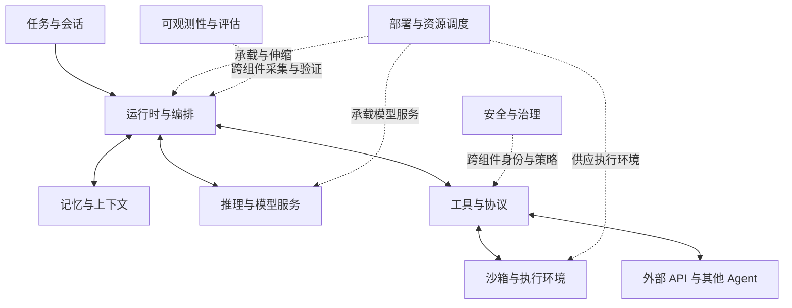

# Agentic Infra 的范围、组件与分类边界

整理日期：2026-09-26。本文给出本仓库的工作分类与阅读框架；组件划分是作者的组织方式，不是一套通用标准，也不要求每个系统都部署全部组件。

## 从一次任务执行开始

设想一个需要查询资料、运行代码并输出报告的 Agent。为了完成任务，系统需要决定下一步操作，准备模型上下文，调用模型和外部工具，记录过程，并在中断后处理尚未完成的工作。这个场景可以帮助我们识别基础设施职责。

下面是逻辑关系示意。同一进程或平台可以承担多个职责，实际调用路径由具体实现决定。

观测和治理通常涉及多个组件，图中只画出代表性连线；它们的具体作用范围需要在系统设计中明确。

## 八个主题分别回答什么

| 主题 | 在示例任务中的职责 | 阅读入口 |
| --- | --- | --- |
| Runtime & Orchestration | 安排查询、执行和总结步骤，记录任务进度并决定重试 | [资源](../resources/runtime-and-orchestration.md) |
| Sandbox & Execution | 为生成的代码或浏览器操作提供执行环境与隔离边界 | [资源](../resources/sandbox-and-execution.md) |
| Memory & Context | 保存会话与长期信息，为下一次模型调用选择上下文 | [资源](../resources/memory-and-context.md) |
| Tools & Protocols | 描述工具接口，传递请求和结果，与其他 Agent 互联 | [资源](../resources/tools-and-protocols.md) |
| Inference & Model Serving | 将模型请求路由到后端，处理批执行与推理缓存 | [资源](../resources/inference-and-model-serving.md) |
| Deployment & Scheduling | 分配工作节点、执行环境和服务副本，处理伸缩 | [资源](../resources/deployment-and-scheduling.md) |
| Observability & Evaluation | 解释失败步骤，衡量任务成功率、耗时与资源消耗 | [资源](../resources/observability-and-evaluation.md) |
| Security & Governance | 确认调用主体、检查操作权限并记录审计信息 | [资源](../resources/security-and-governance.md) |

## 容易混淆的边界

**任务编排与资源调度。** 本仓库把“下一步执行什么、失败后从哪里继续”归入运行时，把“在哪个节点执行、需要几个副本、是否提前准备沙箱”归入部署与调度。一个系统可以同时解决这两类问题，主条目按其主要职责归类。

**任务状态、Agent 记忆与 KV cache。** 三者用于本仓库分类时分别表示：执行进度与恢复信息、可用于后续上下文的信息、推理引擎内部的注意力计算缓存。这些机制可能协同工作，但不应仅因名称里包含 memory 就归到同一主题。例如，LangGraph 的持久化文档讨论检查点和执行恢复，PagedAttention 论文讨论推理服务中的 KV cache 管理。[LangGraph 持久化文档](https://docs.langchain.com/oss/python/langgraph/persistence)、[PagedAttention 论文](https://arxiv.org/abs/2309.06180)。

**工具接口与执行环境。** 工具协议负责表达和交换调用信息，执行环境负责承载具体操作。以 MCP 为例，规范说明了客户端与服务器之间的工具交互；隔离代码执行所使用的沙箱属于另一项系统职责。[MCP 规范](https://modelcontextprotocol.io/specification/latest)。

**恢复任务与恢复外部副作用。** 任务能够从检查点恢复，还需要考虑重试是否再次发送请求或修改外部数据。分析持久执行系统时，应同时查看检查点、幂等性和副作用处理规则。例如，Temporal 的 Activity 文档说明了重试可能重复执行操作，以及幂等性设计的作用。[Temporal Activity 文档](https://docs.temporal.io/activity-definition)。

**执行隔离与操作授权。** 本仓库把隔离机制归入沙箱，把“某个主体是否能对某个资源执行某项操作”的规则归入安全与治理。阅读时可分别对照 gVisor 的执行隔离设计和 Cedar 的授权模型。[gVisor 官方说明](https://gvisor.dev/)、[Cedar 官方说明](https://docs.cedarpolicy.com/)。

## 后续分析可以怎样展开

比较项目时，建议围绕一个明确问题组织证据：

| 研究问题 | 值得记录的信息 |
| --- | --- |
| 长任务如何恢复？ | 持久化对象、恢复粒度、重放方式、外部副作用处理 |
| 沙箱如何供应和复用？ | 生命周期、隔离机制、预热策略、文件与进程状态 |
| 上下文如何持续更新？ | 信息来源、写入与检索时机、压缩策略、过期机制 |
| 多 Agent 如何共享资源？ | 并发模型、资源配额、排队方式、租户边界 |
| 优化是否改善任务体验？ | 完成率、端到端耗时、重试次数、模型与工具用量 |

这些是分析问题，并非本仓库已经获得的实验结论。后续实测应固定模型、任务集、软件版本与资源配置，并记录原始结果和复现方法。

[返回笔记索引](README.md) · [返回首页](../README.md)
