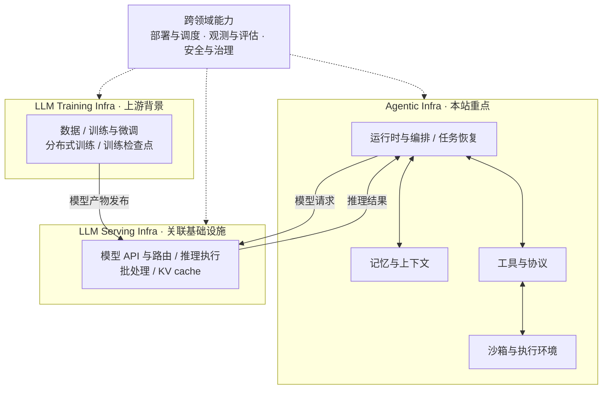

# Agentic Infra 领域导览

本篇介绍 Agentic Infra、LLM Serving Infra 与 LLM Training Infra 的职责与关系，并提供七个主要主题及关联基础设施的资源入口。

## 三个基础设施领域

本仓库按主要职责组织内容：Agentic Infra 关心任务如何持续、可靠地完成，Serving 关心模型请求如何高效、稳定地执行，Training 关心模型如何训练与更新。

| 领域 | 处理的主要对象 | 典型能力 | 在本仓库中的位置 |
| --- | --- | --- | --- |
| **Agentic Infra** | 任务、会话、执行状态与工具操作 | 运行时与编排、任务恢复、记忆与上下文、工具互联、沙箱执行 | 核心内容 |
| **LLM Serving Infra** | 模型请求、推理批次与推理缓存 | 模型 API、路由、推理执行、批处理、KV cache 管理 | 关联基础设施，围绕 Agent 的模型调用需求展开 |
| **LLM Training Infra** | 训练数据、模型参数与训练状态 | 数据流水线、训练与微调、分布式训练、优化器、训练检查点与模型产物 | 上游背景，暂不单独设置资源主题 |

一个产品可能覆盖多个领域，本仓库按主要职责分类。

## 领域间的协作关系

Agentic Infra 调用 Serving 并接收推理结果；Training 向 Serving 交付模型产物。日常 Agent 任务使用已经部署的模型服务。

这里按职责划分边界，同一进程或平台可以承担多个职责，三个领域也可以独立部署。图中实线表示组件交互与模型交付，虚线表示跨领域能力的作用范围。

部署与调度、观测与评估、安全与治理都服务于多个领域。本仓库关注它们在 Agent 工作负载中的应用。

## 主题导航与关联基础设施

七个主要主题构成阅读目录：前四项展开 Agentic Infra 的核心能力，后三项讨论跨领域能力在 Agent 侧的应用。模型服务作为关联基础设施单独提供阅读入口，训练作为上游背景在本文说明。

| 主题 | 主要职责 | 资源入口 |
| --- | --- | --- |
| Runtime & Orchestration | 执行流程、多 Agent 协作、任务状态与恢复 | [资源](../resources/runtime-and-orchestration.md) |
| Sandbox & Execution | 为生成的代码或浏览器操作提供执行环境与隔离边界 | [资源](../resources/sandbox-and-execution.md) |
| Memory & Context | 保存会话与长期信息，为下一次模型调用选择上下文 | [资源](../resources/memory-and-context.md) |
| Tools & Protocols | 描述工具接口，传递请求和结果，与其他 Agent 互联 | [资源](../resources/tools-and-protocols.md) |
| Deployment & Scheduling | 分配工作节点、执行环境和服务副本，处理伸缩 | [资源](../resources/deployment-and-scheduling.md) |
| Observability & Evaluation | 追踪执行过程，衡量任务质量、耗时与资源消耗 | [资源](../resources/observability-and-evaluation.md) |
| Security & Governance | 确认调用主体、检查操作权限并记录审计信息 | [资源](../resources/security-and-governance.md) |

**关联基础设施：[Inference & Model Serving](../resources/inference-and-model-serving.md)。** 收录模型接入、请求路由与推理服务资料，关注它们与 Agent 多轮调用、长上下文和并发需求的联系。

## 容易混淆的边界

- **任务编排与资源调度**：下一步执行什么、任务如何继续，归入运行时；执行环境如何供应、资源如何分配，归入部署与调度。
- **任务状态、Agent 记忆与 KV cache**：执行进度归入运行时，供后续上下文使用的信息归入记忆，推理引擎的 KV cache 归入关联的模型服务。
- **工具接口与执行环境**：工具的发现和调用规则归入工具与协议，承载代码或浏览器操作的环境归入沙箱与执行。
- **执行隔离与操作授权**：隔离边界归入沙箱，身份、权限、策略与审计归入安全与治理。

跨主题项目只维护一个完整主条目，其他主题通过链接关联。查找具体框架和平台可继续阅读 [Agent Runtime 全景](agent-runtime-landscape.md)。

[返回资源导览](README.md) · [返回首页](../README.md)
