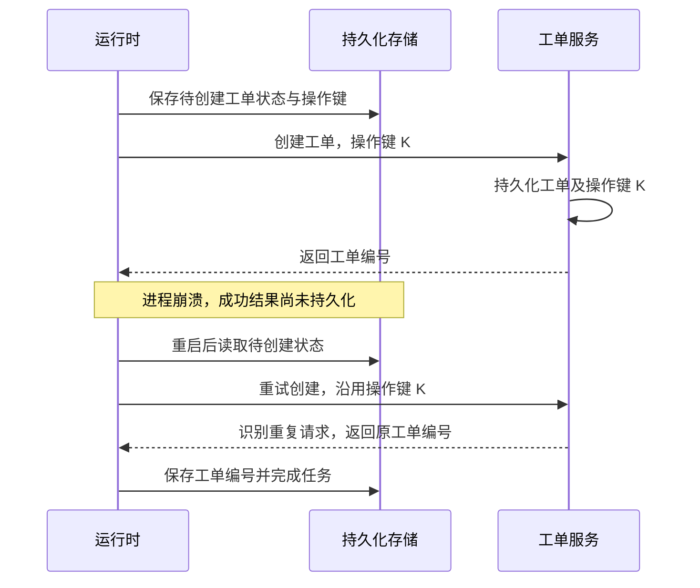

# 任务失败后如何恢复：检查点、重试与外部副作用

Agent 已经生成报告，也把报告提交到了工单系统，进程却在收到响应后崩溃。重新启动时，应该继续通知用户，还是再次提交报告？理解这个问题，需要同时看运行时保存了什么、哪些代码会重新执行，以及外部系统如何识别重复请求。

本文用一个概念场景拆解恢复边界：查询订单 → 生成报告 → 人工审核 → 创建工单 → 返回结果。文中的设计建议围绕这个场景展开，具体机制对应 LangGraph 与 Temporal 的官方文档。

## 检查点保存的是任务进度

先为报告任务设计状态：订单编号、报告内容或存储地址、待执行步骤、审批决定、工单编号。只有把恢复所需的信息纳入持久化范围，重启后才有依据判断下一步。保存在本地临时变量中的报告，不能仅靠重新启动进程找回来。

LangGraph 用 checkpointer 保存某个 `thread_id` 下的图状态；跨线程共享的数据则由 store 承载。内存型 `InMemorySaver` 的内容会随进程退出丢失，跨进程恢复需要持久化后端。[LangGraph 持久化](https://docs.langchain.com/oss/python/langgraph/persistence)

图状态快照在 super-step 边界形成；并行步骤中已完成节点的 pending writes，可以避免恢复时重复计算这些节点。写入时机也影响恢复：`sync` 在下一步之前完成持久化，`async` 与下一步并行写入，`exit` 只在执行退出时保存。因此，“配置了检查点”还需要落实到保存粒度与落盘时机。[LangGraph Checkpointers](https://docs.langchain.com/oss/python/langgraph/checkpointers)

对于示例任务，我建议把“报告生成完成”“审核通过”“工单创建结果”作为独立进度，让昂贵的生成步骤与外部写入分开。检查点中的“准备创建工单”只表达内部进度，并不能证明工单系统尚未收到请求。

## 重放与重试分别做什么

恢复任务可能需要重建运行状态，也可能需要再次尝试失败操作。这两件事的外部影响不同，而且不同框架对 replay 的含义也不完全相同。

| 机制 | 恢复时发生什么 | 对示例任务的含义 |
| --- | --- | --- |
| Temporal Workflow replay | 根据事件历史重新运行编排代码，核对产生的命令 | 恢复“报告已完成，等待工单结果”的执行位置 |
| Activity 重试 | 在策略允许时再次执行 Activity | 创建工单请求可能再次发出 |
| LangGraph 历史检查点 replay | 跳过检查点之前的步骤，重新执行之后的节点 | 后续模型调用、API 请求和中断可能重新触发 |

Temporal 的 replay 依赖事件历史；已经记录完成的 Activity 不会因为 Workflow replay 再执行。LangGraph 从历史 `checkpoint_id` 主动重放则会重新运行其后的步骤，应与失败恢复时复用已保存结果区分。[Temporal Replay](https://docs.temporal.io/workflow-execution#replays)、[Activity 的完成记录](https://docs.temporal.io/activity-definition#idempotency)、[LangGraph Replay](https://docs.langchain.com/oss/python/langgraph/checkpointers#replay)

为了保持 Temporal 编排代码可重放，模型调用、数据库查询等非确定性操作应放进 Activities。代码升级同样需要考虑旧任务历史与新代码的兼容性。[Temporal 确定性约束](https://docs.temporal.io/workflow-definition#deterministic-constraints)

## 最容易遗漏的失败窗口

下面的时序图展示一种可能的故障：外部工单已创建，运行时尚未持久化成功结果。图中的幂等键属于示例设计。

Temporal 文档明确说明：Activity 已执行成功、Worker 却未上报完成时，Activity 仍可能被重试。运行时无法只根据本地的未完成状态，判断外部操作是否发生。换成发邮件或提交订单，同样需要处理这个确认缺口。[Activity 幂等性与失败窗口](https://docs.temporal.io/activity-definition#idempotency)

因此，业务上的“一次生效”需要外部服务参与。运行时的持久执行能力不能单独保证所有工具调用都只产生一次效果。

## 幂等键如何落实到业务

示例中可用 `report:<订单编号>:<报告版本>:create-ticket` 标识一次业务操作，首次调用前保存，重试时沿用。新的报告版本使用新键；同一个操作键不应携带悄悄改变的请求参数。

接收方需要真正执行去重，例如让操作键具有唯一约束，并在同一数据库事务中记录操作与业务结果。只在调用方先查询一次“是否完成”，无法防止并发请求同时通过检查。Temporal 官方的幂等性文章给出了唯一键和事务示例；Activity 文档也说明，幂等键由被调用服务执行约束。[幂等性设计示例](https://temporal.io/blog/idempotency-and-durable-execution)、[Activity 幂等键](https://docs.temporal.io/activity-definition#idempotency)

把这些机制用于报告任务时，还应约定去重记录的保留时间和重复请求的返回值。如果目标 API 不支持幂等键，需要利用业务编号核对结果，或把不确定结果交给人工处理。单独增加一个“已发送”数据库字段，仍无法把远端 API 调用变成本地事务的一部分。

重试策略也应区分临时错误与业务拒绝，并限制持续时间或次数；Temporal 的 Retry Policy 提供退避、最大尝试次数和不可重试错误等配置。重复提交无法修复无效参数或未通过的审核。[Temporal Retry Policy](https://docs.temporal.io/encyclopedia/retry-policies)

## 人工审批也是恢复边界

LangGraph 的 `interrupt()` 可以暂停并等待外部输入，恢复时使用相同 `thread_id` 传入 `Command(resume=...)`。需要注意：恢复会从所在节点开头重新执行，`interrupt()` 之前的代码也会再次运行。[LangGraph Interrupts](https://docs.langchain.com/oss/python/langgraph/interrupts#resuming-interrupts)

在示例中，我建议让审批节点只展示待审核报告并接收决定，工单创建放在后续独立节点。这样审批前的重复执行不会提前创建工单；后续创建节点仍需幂等设计。审批记录应绑定报告版本，报告改动后重新判断原审批是否适用；业务入口负责校验审批者身份和权限，恢复参数本身不能代替授权。

## 设计与验证时检查什么

下面是从示例推导的检查表，可用于设计评审或故障注入实验：

| 检查问题 | 需要观察的结果 |
| --- | --- |
| 报告生成后终止进程，能否恢复？ | 报告内容和下一步均可从持久化存储读回 |
| 工单创建后丢弃响应，会不会重复创建？ | 同一操作键对应同一业务结果 |
| 两个请求并发恢复同一操作，如何去重？ | 去重约束在接收端成立，不依赖先查后写 |
| 审核等待期间重启，恢复的是哪个版本？ | 任务、报告版本和审批记录相互对应 |
| 错误持续发生或参数无效，何时停止重试？ | 有明确的截止条件与后续处理状态 |

继续阅读可从本站的 [LangGraph 条目](../resources/runtime-and-orchestration.md#resource-langgraph) 和 [Temporal 条目](../resources/runtime-and-orchestration.md#resource-temporal) 进入官方资料。阅读时，先确认恢复边界，再核对每个外部写入的去重契约；这两部分共同决定任务在中断后能否正确完成。

[返回笔记索引](README.md) · [返回首页](../README.md)
